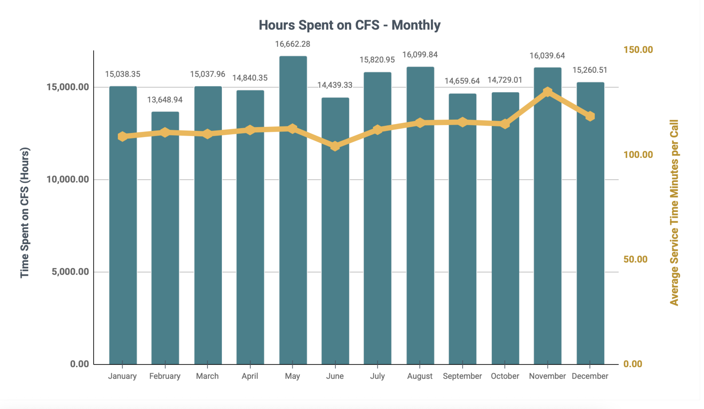
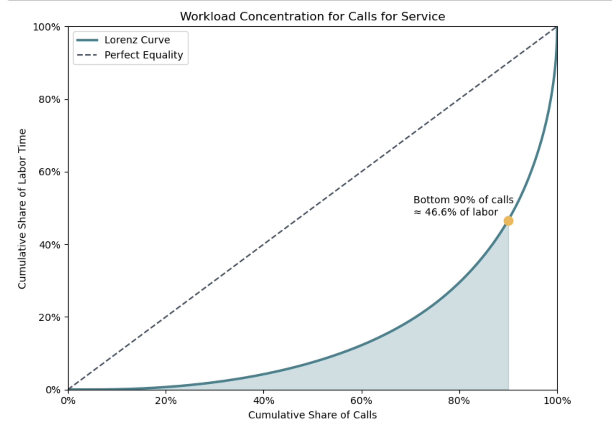
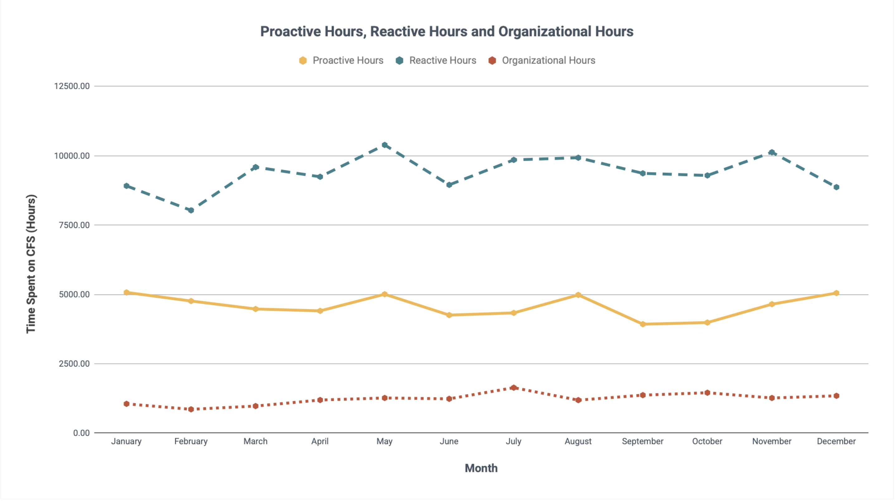
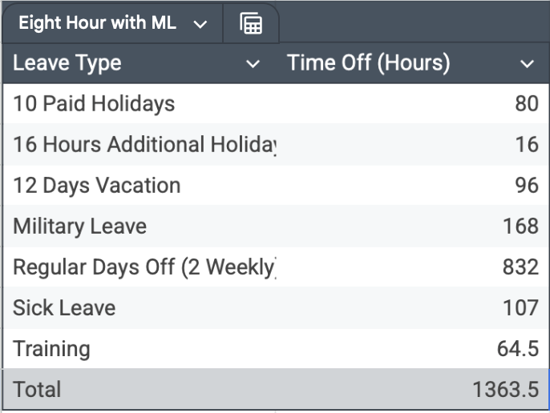
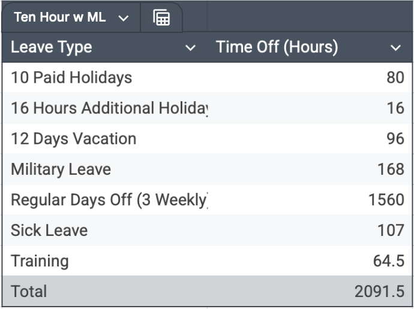
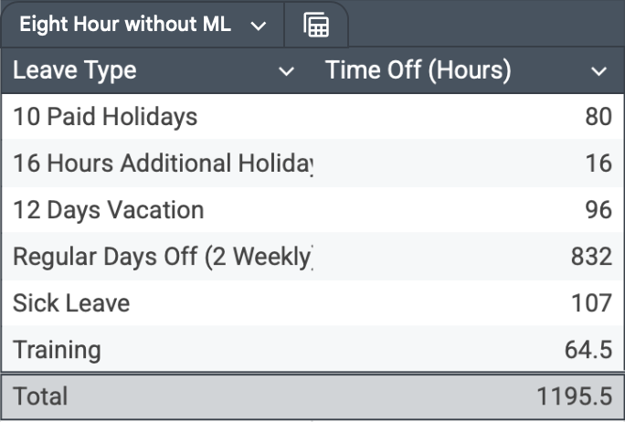
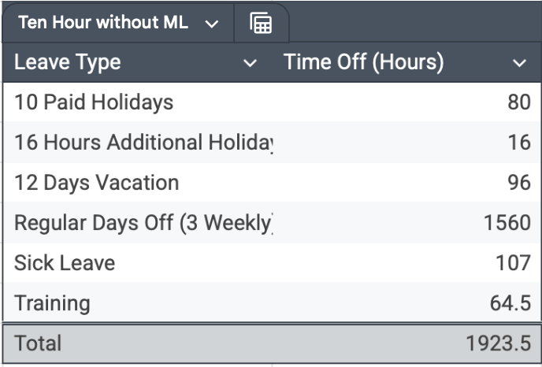
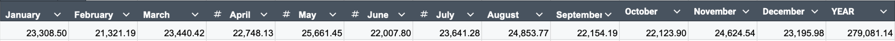

# Seattle Police Department West Precinct Staffing Analysis

This analysis reviews the workload of SPD West to aid the department in determining sufficient staffing levels. The objective is to determine whether the number of sworn officers aligns with workload demand, and to provide a defensible framework for staffing decisions. The entire workload analysis can be found [here.](#workload-assessment)

## Executive Summary
### Purpose
To aid SPD West in determining suitable staffing levels, by providing a workload analysis and making staffing recommendations based on findings. 
The analysis followed a methodical process based on recent research completed through Michigan State University by Jeremy M. Wilson and Alexander Weiss with support from the Community Oriented Policing Services and funded by The Department of Justice. Benchmarks and staffing reccomendations are based on the industry standard of the Rule of 60.

The Rule of 60 principle has two aspects.
1. 60% of all sworn officers should be assigned to patrol and respond to routine incidents.
2. 60% of officer patrol time should be committed to responding to the service demands of the community.

### Benchmarks
- Patrol shifts should have enough officers staffed so that 60% of time is dedicated to estimated CFS obligations. Leaving 40% available for activities outside of CFS.
- 60% of the department should be assigned to patrol.

### Insights
- SPD West responded to 96,383 unique calls for service, requiring 182,278 hours of recorded labor. A total of 169,260 CAD records were associated with these events.
- 92% of officer time is spent responding to the needs of the community. 30% is proactive (onview/officer initiated) policing, and 62% is reactive (dispatch) policing.
- 40% of calls occur between the hours of 0600 - 1400, highlighting where labor should be concentrated.
- 46% of all sworn officers are assigned to patrol [^1], showing demand for officers.

### Reccomendations
- SPD West should add additional officers to the workforce to reach levels needed to respond to CFS without risking officer burnout. As more officers are trained, every effort should be made to have ~60% of officers assigned to patrol.
  - To get to benchmark numbers, the department should have a total of 279,080 annual working hours employing between 228 and 242 officers.
  - Officers assigned to patrol should be 137 - 146.
- SPD West should continue adding more hours to community events, engaging with community members, and building relationships with businesses and schools. 
- Shift schedules should align with concentration of calls based on CFS data.
  - For instance, Fridays are the busiest days and should be given 17% of the total hours for the week, 40% of allotted daily hours should be scheduled from 0600 - 1400, etc.

### Future Analyses and Model Validation
Integrating crime data for counties within SPD West would give empirical data to establish a foundation on on which department goals can be built upon. It would also show how crime changes over the years, and inform strategies for proactive policing. Combining the workload analysiss, crime analysis and staffing benchmarks would provide a larger picture of how these variables simpact each other and show where goals should be focused.

To strengthen forecasting confidence for 2026 and beyond, additional historical data from 2024 and 2025 should be incorporated.
Further analysis should evaluate year-over-year trends in workload, and criminal activity to determine whether observed changes represent stable patterns or are indicative of the department being under-staffed. Specifically:  
- How does total call volume change year over year?
- How does total labor time spent on CFS change year over year?
- Are changes in call volume and labor hours consistent across multiple years?
- What is the year-over-year population change within the service area?
- Does population growth correlate with changes in call volume?
- Does population growth correlate with changes in total labor hours?
- How does crime change year over year? Does property crime, crime against the person, and crime against society increase/decrease at the same rates?

Evaluating these factors using percent change adjustments will provide a strong foundation for budget planning, staffing projections, and performance benchmarking.

# Workload Assessment
## Defining Workload
Following guidance from the International City/County Management Association (ICMA)[[4]](#4), the “Rule of 60” recommends that approximately 60% of sworn personnel be assigned to patrol functions. This structure ensures sufficient capacity not only for responding to calls for service, but also for community engagement, training, retention planning, and specialized initiatives. To evaluate whether current staffing aligns with this principle, workload must be clearly defined. Distinguishing reactive, proactive, and organizational time is essential for determining whether patrol staffing supports both emergency response and community-oriented policing goals. Therefore, this analysis relies on the following definitions. For a complete list of how call types are mapped, refer [here.](data/call-type-mapping.csv)
|Term |Definition|Call Types Included|Example|
|--|--|--|--|
|Reactive Patrol Demand |Demand-driven and time-sensitive calls. |Crime, Alarms, Warrants, Non-Officer initiated Calls, Dispatch Events||
|Proactive / Community Patrol Activity |Officer initiated or capacity based calls.|Directed patrol activity, Officer Initiated Calls, School Visits, Special Events||
|Organizational / Out-of-Service Workload|Work that removes officers from patrol availability.|Court, Training, Out At Range, Reports, Maintenance of Vehichles, Follow Up's||

The `final_call_type` titled 'Off Duty Employment' is excluded from this analysis because it will skew the analysis and will be addressed in the agency relief metric.

## Distribution of Calls for Service
### By Hour
- 6AM - 2PM contains 40% of calls  
- 2PM - 10PM contains 38% of calls  
- 10PM - 6AM contains 22% of calls

  

### By Day

Analysis of total CFS counts by day of week shows significant variation. Fridays account for 16.5% of the total annual call counts.

Additionally, Friday has the longest average call duration (121.7 minutes per call), further compounding workload pressure. Saturday also shows elevated average call duration (118.2 minutes), suggesting increased call complexity on weekends.
These findings indicate that workload is not evenly distributed across the week. Staffing models that assume uniform daily demand may under resource higher demand days, particularly Fridays, while over allocating labor on days with lower demand.

  

### By Month

There is mild fluctuation seasonally, with an 18% difference between the highest and lowest months. Average monthly calls = 8,145. Looking at the year, demand ramps up from late spring ot summer, and begins to dip in late fall. This is to be expected as the summer months bring more outdoor activity, more interactions, and more conflict.

  

## Time Spent on Calls

### By Month
SPD West expended between 13,649 and 16,662 labor hours per month in 2023, with May representing the peak workload period.  

Although monthly call volume fluctuates, average service time remains stable with values ranging from 104 minutes to 130 minutes. This stability indicates that high-duration events are not rare anomalies but a consistent feature of patrol workload.  

  

Service time is highly skewed, which is to be expected in emergency services. The median call lasts approximately 45 minutes, while the mean is 116 minutes. This gap is a direct reflection of workload concentration, as the top 10% of calls account for 53% of total labor hours.  

  

For staffing projections, total aggregated labor hours (reflected in the mean) most accurately capture resource demand. While the median describes a typical call, relying on it for staffing predictions would underestimate staffing needs where labor consuming events occur regularly. These events represent baseline operational demand rather than sporadic outliers, and staffing models should therefore be grounded in total annual workload while accounting for the volatility introduced by a heavy-tailed distribution.

### Proactive vs. Reactive vs. Organizational Workload
In 2023, SPD West spent 182,276.8 hours responding to calls for service. That time is divided with 62% being reactive (dispatch), 30% proactive (onview), and 8% organizational. Because the CAD data includes categories like downtime, follow-up, informational broadcasts, training, and court, this reflects the full workload—not just call response. Even with that broader scope, only 8% of time was spent on organizational and foundational needs. This means the department was running in continuous triage or patrol mode without slack.

Additionally, proactive and reactive work together account for 92% of total workload. That level is extremely high, given necessary administrative, training, and reporting demands. Reporting currently falls under organizational workload, meaning core documentation and follow-up functions compete within that limited 8%.

This imbalance aligns with broader context: 2023 marked SPD’s lowest staffing level in 30 years[[5]](#5), prompting city leadership to prioritize rebuilding the department. The data suggests a near-constant tempo dominated by reactive patrol which is not sustainable and risks officer burnout.

 

## Establishing Performance Objectives
The way which agencies are directed to allocate their time determines how workload metrics influence staffing hours[[2]](#2). Each agency will have unique needs based on the demographics of the population the department is serving, geographical factors and distribution of the workforce by skill, rank, and seniority.  A few examples of possible benchmarks are provided, but would normally be dictated by department leaders, policy makers, and the community.

### On-Duty Time Allocations
- Patrol time should have 40% available for activities outside of CFS
### Staffing Levels
- The number of officers the department employs should allow for 60% of total workforce to be assigned to patrol, and for 60% of patrol time to be allocated to CFS.
### Training
- Each officer should complete 64.5 hours of training a year specific to the needs of the community. Some areas to consider might be language needs, special training based on geographical factors (harbor, mountainous regions, etc.), technological advances, among others.
- There should be clear plans and training taking place to ensure smooth transitions when leadership retires or is promoted.

## Determining Agency Shift Relief Metric
Investigating [Seattle Police Department Positions](https://seattlepolicejobs.com/police-officer/), an entry level officer recieves the following as part of their benefits package.
- 10 paid holidays
- 16 hours additional holiday time
- 12 days paid vacation (with accrual increasing as longevity grows)
- 21 days paid military leave

Other considerations:
- Normal non-working days per week
- Sick leave at 107 hours/year
- Training

Because military leave is not leave that every officer will have, there are 4 different relief equations used based on the following tables.
Additional tables should be made accounting for vacation accrual for senior level officers.

### Shifts with Military Leave

  
   

### Shifts without Military Leave

  
   

To calculate agency relief, the following equation is used.

$$
\frac{365 \times \text{Shift Length}}{(365 \times \text{Shift Length}) - \text{Total Time Off}}
$$

Resulting in the following relief factors. 

|Shift Type|Relief Factor|
|--|--|
|8 Hour Shift with Military Leave|1.88|
|8 Hour Shift without Military Leave|	1.69|
|10 Hour Shift with Military Leave|	2.34|
|10 Hour Shift without Military Leave|	2.11|

This means for these various shifts, 1.7 - 2.3 officers would have to be assigned to a shift to ensure 1 is working at any given time.

## Process
### Data Gathering
1. 2025 Data (147,776 records)
   1. CAD Event Number - starts with - 2025 AND Dispatch Precinct is WEST
   2. VALIDATION: To ensure data was accurately captured, I ran the following query with a result of 147,778 records. I felt comfortable leaving the query as it was, going off of the CAD event number.
      1. CAD Event Original Time Queued is between 2025 Jan 01 12:00:00 AM AND 2026 Jan 01 12:00:00 AM AND Dispatch Precinct is WEST
2. 2024 Data (152,602 records)
   1. CAD Event Number - starts with - 2024 AND Dispatch Precinct is WEST
4. 2023 Data (169,260 records)
   1. CAD Event Number - starts with - 2023 AND Dispatch Precinct is WEST
  
All CSV's had to be pre-processed to load appropriately into BigQuery. This involved writing the files from .csv to a .paraquet file. This proceess is found [here.](Python/cad_data_preprocessing.ipynb)

### Calculations and Explanations for Reccomendations

Currently, the departments total workload in hours is 182,276 and 92% is patrol work.
Total Workload = 182,276 hours
Patrol Workload = 167,448 hours

Benchmark: Patrol Workload = 60%  of Total Workload
Patrol Workload = 167,448 hours
New Total Workload = 279,080 hours

If every officer worked 40 hours/week every week, that would mean the department needs a total of 134.17 officers. To accomodatee agency relief at 1.8, the department needs to employ 242 officers. If agency relief is at 1.69, the department needs to employ 228 officers.

If CFS distribution stays the same, staffing should aim to meet demand and estimatee 60% of time to be spent on CFS.
Calculations for New Workload Hours per month were calculated using the same logic for the yearly calculations.

  

The analysis establishes a systematic method for evaluating operational demand based on several factors, and following research for a full-scope review of officer time. [[2]](#2)
- Temporal distribution of Calls for Service (hour, day, month)
- Time spent on CFS
- Nature of calls
- Geographic distribution of workload by beat

Staffing recommendations are derived from:
- Workload-based hour calculations
- Agency shift relief assumptions 
- Department performance objectives
- Rule of 60 principles

## Bibliography
### 1 :
Aponte, C., Perez, A., & Carpenter, A. (2020, November 17). Analyzing Staffing as Cornerstone to Police Transformation. V2A. https://v2aconsulting.com/insights/analyzing-staffing-as-cornerstone-to-police-transformation/  
### 2
Wilson, J., & Weiss, A. (2014). A PERFORMANCE-BASED APPROACH TO POLICE STAFFING AND ALLOCATION. Office of Community Oriented Policiing Policies, U.S. Department of Justice. https://portal.cops.usdoj.gov/resourcecenter/content.ashx/cops-p247-pub.pdf  
### 3
Wilson, J. M., & Grammich, C. A. (2024). Reframing the police staffing challenge: A systems approach to workforce planning and managing workload demand. Policing: A Journal of Policy and Practice, 18. https://doi.org/10.1093/police/paae005
### 4
Center for Public Safety Management, McCabe, J., & International City/County Managemenet Association. (2013). An Analysis of Police Department Staffing: How many officers do you really need?
### 5
lawenforcementtoday.com. (2024, April 9). Seattle police staffing levels at lowest in 30 years, with many officers eligible to retire and others looking to transfer. Lawenforcementtoday.Com. https://lawenforcementtoday.com/seattle-police-staffing
### 6
Police officer. (2025, August 18). Seattle PD. https://seattlepolicejobs.com/police-officer/

[^1]: Data on the number of officers specific to SPD West could not be found for 2023. Therefore, patrol numbers are based on the percentages found for SPD as a whole in 2023. According to Law Enforcement Today, "as of December 31, 2023, out of the 913 officers, SPD only has 424 police officers working patrol[[5]](#5)."
