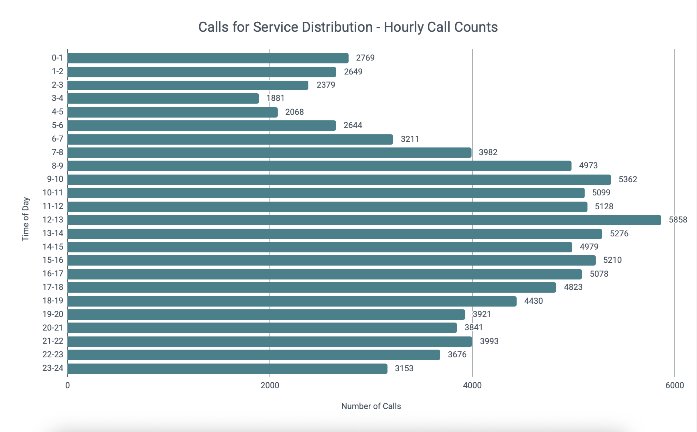
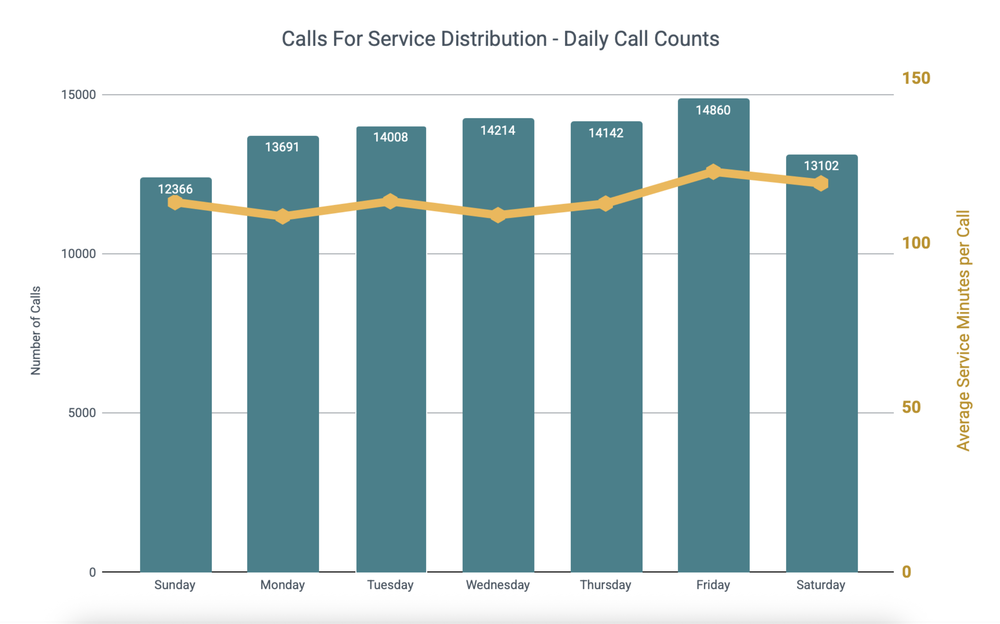
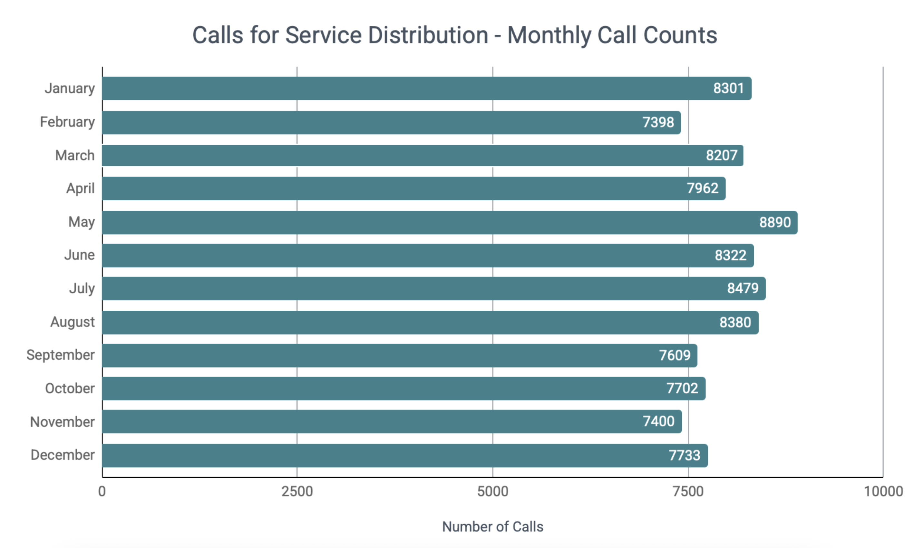

# Seattle Police Department West Precinct Staffing Analysis
This project aims to inform future officer staffing needs based on historical data from Seattle Police Department's CAD database. 

## Executive Summary
This analysis quantifies the workload of the Seattle Police Department’s West Precinct and links documented labor demand to staffing requirements. The objective is to determine whether current workforce allocation aligns with reactive, proactive, and administrative responsibilities, and to provide a defensible framework for staffing decisions. The entire workload analysis can be found [here.](#workload-assessment)

In 2023, SPD West responded to 96,383 unique calls for service, requiring 182,278 hours of recorded labor. A total of 169,260 CAD records were associated with these events, reflecting the full scope of documented workload activity. According to Law Enforcement Today, "as of December 31, 2023, out of the 913 officers, SPD only has 424 police officers working patrol[[5]](#5)."

### Purpose
This report has two purposes.
1. Complete Workload Analysis
2. Give reccomendations to align workload with sustainable staffing practices.

The analysis establishes a systematic method for evaluating operational demand based on several factors, and following research for a full-scope review of officer time. [[2]](#2)
- Temporal distribution of Calls for Service (hour, day, month)
- Time spent on CFS
- Nature of calls
- Geographic distribution of workload by beat

Staffing recommendations are derived from:
- Workload-based hour calculations
- Agency shift relief assumptions 
- Department performance objectives
- Rule of 60 principles

### Reccomendations for 'Rule of 60' Adherence

### Recommended Staffing Framework
**1. Forecast Monthly Workload Hours**
  
Determine total monthly workload hours using projected call volume and projected average service time:

$$
H_m = \frac{\bar{t}_m \times \bar{n}_m}{3600}
$$

Where:
- $H_m$ = monthly allotted hours
- $\bar{t}_m$ = average time per call in month $m$
- $\bar{n}_m$ = average number of calls in month $m$

**2. Allocate Workload Hours by Shift**  

**3. Convert Monthly Shift Hours to Daily Requirements**  

**4. Determine Required Officers per Shift**  

**5. Convert Required Officers Needed in Accordance with the 'Rule of 60' Guidelines**  

**6. Determine Required Officers per Shift**  

## Future Analyses and Model Validation
The current staffing framework is based on one year of data. To strengthen forecasting confidence for 2026 and beyond, additional historical data from 2024 and 2025 should be incorporated.

Further analysis should evaluate year-over-year trends in workload drivers to determine whether observed changes represent stable patterns or short-term variability. Specifically:  
- How does total call volume change year over year?
- How does total labor time spent on CFS change year over year?
- Are changes in call volume and labor hours consistent across multiple years?
- What is the year-over-year population change within the service area?
- Does population growth correlate with changes in call volume?
- Does population growth correlate with changes in total labor hours?  
Evaluating these factors using percent change adjustments will provide a stronger empirical foundation for budget planning, staffing projections, and performance benchmarking.

# Workload Assessment
## Defining Workload
Following guidance from the International City/County Management Association (ICMA)[[4]](#4), the “Rule of 60” recommends that approximately 60% of sworn personnel be assigned to patrol functions. This structure ensures sufficient capacity not only for responding to calls for service, but also for community engagement, training, retention planning, and specialized initiatives. To evaluate whether current staffing aligns with this principle, workload must be clearly defined. Distinguishing reactive, proactive, and organizational time is essential for determining whether patrol staffing supports both emergency response and community-oriented policing goals. Therefore, this analysis relies on the following definitions. For a complete list of how call types are mapped, refer [here.](data/call-type-mapping.csv)
|Term |Definition|Call Types Included|Example|
|--|--|--|--|
|Reactive Patrol Demand |Demand-driven and time-sensitive calls. |Crime, Alarms, Warrants, Non-Officer initiated Calls, Dispatch Events||
|Proactive / Community Patrol Activity |Officer initiated or capacity based calls.|Directed patrol activity, Officer Initiated Calls, School Visits, Special Events||
|Organizational / Out-of-Service Workload|Work that removes officers from patrol availability.|Court, Training, Out At Range, Reports, Maintenance of Vehichles, Follow Up's||

The `final_call_type` titled 'Off Duty Employment' is excluded from this analysis because it will skew the analysis and will be addressed in the agency relief metric.

## Distribution of Calls for Service
### By Hour
- 6AM - 2PM contains 40% of calls  
- 2PM - 10PM contains 38% of calls  
- 10PM - 6AM contains 22% of calls
 

### By Day

Analysis of total service hours by day of week shows significant variation. Fridays account for 16.5% of the total annual service hours, which is 30% more workload than Sundays (12.7%), the lowest demand day.

Additionally, Friday has the longest average call duration (121.7 minutes per call), further compounding workload pressure. Saturday also shows elevated average call duration (118.2 minutes), suggesting increased call complexity on weekends.
These findings indicate that workload is not evenly distributed across the week. Staffing models that assume uniform daily demand may under resource higher demand days, particularly Fridays, while over allocating labor on days with lower demand.
 

### By Month

There is mild fluctuation seasonally, with an 18% difference between the highest and lowest months. Average monthly calls = 8,145. Looking at the year, demand ramps up from late spring ot summer, and begins to dip in late fall. This is to be expected as the summer months bring more outdoor activity, more interactions, and more conflict.

 

## Time Spent on Calls
### Hours Worked Distributed by Time of Day
 

### By Month
SPD West expended between 13,649 and 16,662 labor hours per month in 2023, with May representing the peak workload period.  

Although monthly call volume fluctuates, average service time remains stable with values ranging from 104 minutes to 130 minutes. This stability indicates that high-duration events are not rare anomalies but a consistent feature of patrol workload.  

Service time is highly skewed, which is to be expected in emergency services. The median call lasts approximately 45 minutes, while the mean is 116 minutes. This gap is a direct reflection of workload concentration, as the top 10% of calls account for 53% of total labor hours.  

For staffing projections, total aggregated labor hours (reflected in the mean) most accurately capture resource demand. While the median describes a typical call, relying on it for staffing predictions would underestimate staffing needs where labor consuming events occur regularly. These events represent baseline operational demand rather than sporadic outliers, and staffing models should therefore be grounded in total annual workload while accounting for the volatility introduced by a heavy-tailed distribution.
 

### Proactive vs. Reactive vs. Organizational Workload

## Establishing Performance Objectives
The way which agencies are directed to allocate their time determines how workload metrics influence staffing hours[[2]](#2). 

## Determining Agency Shift Relief Metric

## Process
### Data Gathering
1. 2025 Data (147,776 records)
   1. CAD Event Number - starts with - 2025 AND Dispatch Precinct is WEST
   2. VALIDATION: To ensure data was accurately captured, I ran the following query with a result of 147,778 records. I felt comfortable leaving the query as it was, going off of the CAD event number.
      1. CAD Event Original Time Queued is between 2025 Jan 01 12:00:00 AM AND 2026 Jan 01 12:00:00 AM AND Dispatch Precinct is WEST
2. 2024 Data (152,602 records)
   1. CAD Event Number - starts with - 2024 AND Dispatch Precinct is WEST
4. 2023 Data (169,260 records)
   1. CAD Event Number - starts with - 2023 AND Dispatch Precinct is WEST
  
All CSV's had to be pre-processed to load appropriately into BigQuery. This involved writing the files from csv's to a .paraquet file. This is found [here.](Python/cad_data_preprocessing.ipynb)
## Bibliography
### 1
Aponte, C., Perez, A., & Carpenter, A. (2020, November 17). Analyzing Staffing as Cornerstone to Police Transformation. V2A. https://v2aconsulting.com/insights/analyzing-staffing-as-cornerstone-to-police-transformation/  
### 2
Wilson, J., & Weiss, A. (2014). A PERFORMANCE-BASED APPROACH TO POLICE STAFFING AND ALLOCATION. Office of Community Oriented Policiing Policies, U.S. Department of Justice. https://portal.cops.usdoj.gov/resourcecenter/content.ashx/cops-p247-pub.pdf  
### 3
Wilson, J. M., & Grammich, C. A. (2024). Reframing the police staffing challenge: A systems approach to workforce planning and managing workload demand. Policing: A Journal of Policy and Practice, 18. https://doi.org/10.1093/police/paae005
### 4
Center for Public Safety Management, McCabe, J., & International City/County Managemenet Association. (2013). An Analysis of Police Department Staffing: How many officers do you really need?
### 5
lawenforcementtoday.com. (2024, April 9). Seattle police staffing levels at lowest in 30 years, with many officers eligible to retire and others looking to transfer. Lawenforcementtoday.Com. https://lawenforcementtoday.com/seattle-police-staffing

