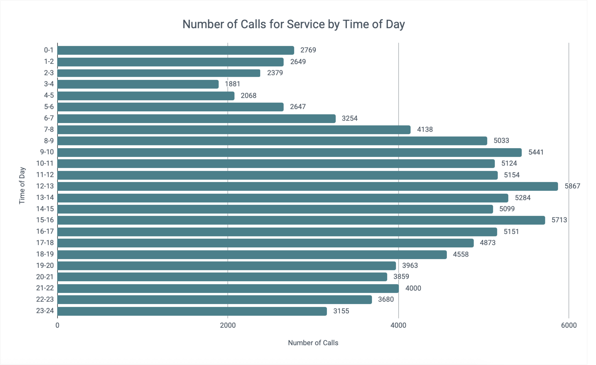
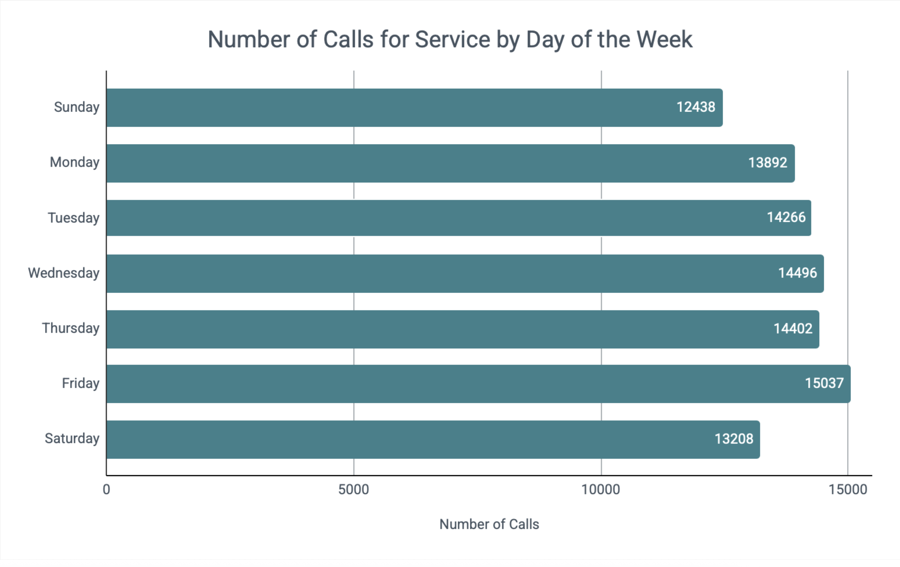
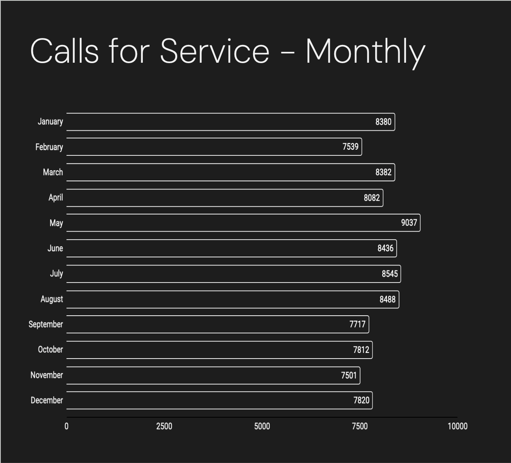
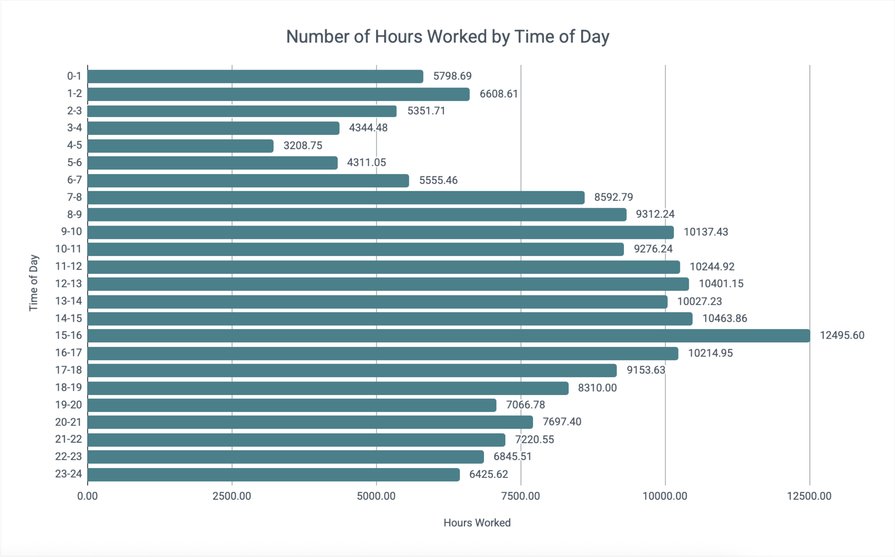
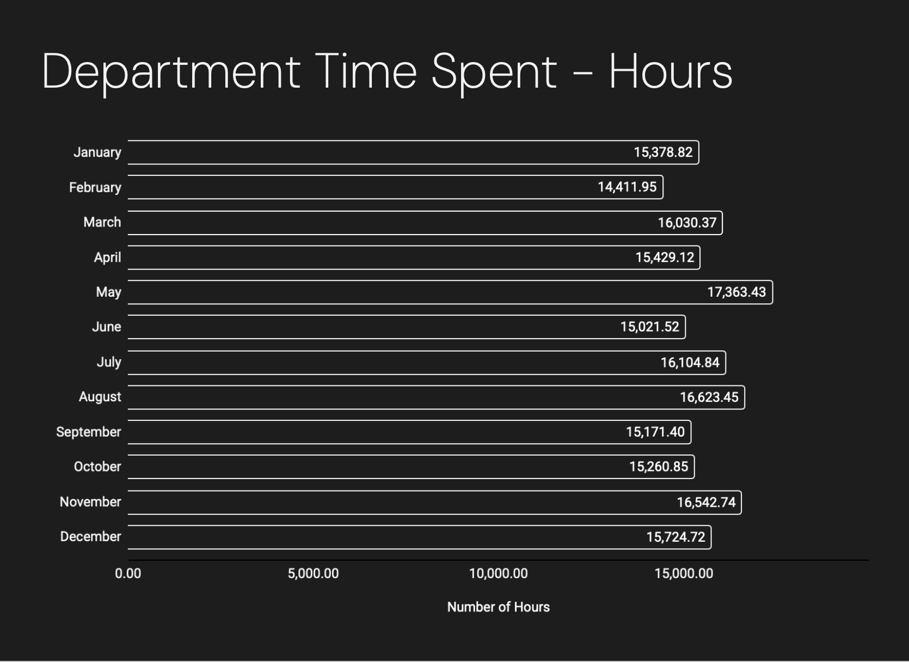
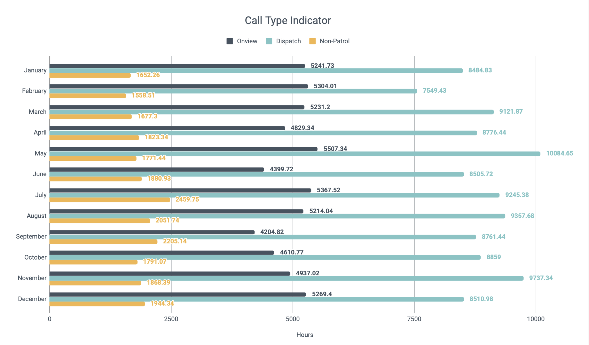

# Police Staffing Analysis
This project aims to inform future officer staffing needs based on historical data from Seattle Police Department's CAD database. 

## Table of Contents
1. [Executive Summary](#executive-summary)
   - [Purpose](#purpose)
   - [Findings](#findings)
   - [Reccomendations](#reccomendations)
2. [Workload Assessment](#workload-assessment)
3. [Staffing Reccomendations](#staffing-reccomendations)
## Executive Summary
This analysis aims to link workload of the Seattle Police Departments West Precinct and worforce numbers to ensure there is enough officer coverage where and when they are needed to keep up with reactive, proactive, and administrative duties. The first goal is to quantify the workload of Seattle Police Department's West precinct, then give staffing reccomendations based on number of hours needed.

2023 brought 97,739 unique calls to Seattle Police Department's WEST precinct. There is a total of 169,260 records associated with these calls for service.

### Purpose
This analysis will provide a methodical system for assessing workload based on:
- Distribution of Calls For Service (Time, Day, Month)
- Time spent on calls categorized by final call type
- Nature of calls
- Volume of workload by geographic beat

Staffing reccomendations will be based on:
- Agency Shift Relief Calculations for 8 hour, and 10 hour staffing models
- Performance Objectives from the department
- Metrics from workload analysis
### Findings
In 2023, there were 97,739 unique calls for service to Seattle Police Department's WEST precinct. Servicing these calls needed 189,795.88 hours of labor.

### Reccomendations
*These reccomendations are currently based on one year of data. In order to feel comfortable giving 2026 forecasting estimates for staffing, metrics from 2025 and 2026 must be pulled.*

Answering the following questions in further analyses using the percent change adjustment would provide a logical basis for budget requests, staffing forecasts, tracking department objectives and goals, and other agency needs.
   - How do the number of CFS change year over year? Is this change consistent from 2023-2024? 2024-2025?
   - How do the hours spent on CFS change year over year? Is this change consistent from 2023-2024? 2024-2025?
   - What is the population change year over year?
   - Does population change correlate to a change in hours spent on CFS?
   - Does population change correlate to number of CFS?
### Recommended Staffing Framework
**1. Forecast Monthly Workload Hours**
  
Determine total monthly workload hours using projected call volume and projected average service time:

$$
H_m = \frac{\bar{t}_m \times \bar{n}_m}{3600}
$$

Where:
- $H_m$ = monthly allotted hours
- $\bar{t}_m$ = average time per call in month $m$
- $\bar{n}_m$ = average number of calls in month $m$

Year-over-year percent change adjustments can be applied to call volume, average service time, or total workload hours depending on forecasting strategy.
Because administrative activities, court, training, proactive policing, and other internal obligations are recorded as CAD events, this calculation reflects total documented workload demand, not solely dispatched CFS.

**2. Allocate Workload Hours by Shift**  
Distribute total projected monthly hours using historical percentages of workload by shift.  
Example (January 2024 projection at 5% increase in workload hours):
Total projected hours: 16,147.76
- 6AM–2PM (40%): 6,459.10 hours
- 2PM–10PM (38%): 6,136.15 hours
- 10PM–6AM (22%): 3,552.51 hours

**3. Convert Monthly Shift Hours to Daily Requirements**  
Divide monthly shift hours by the number of days in the month to determine average daily workload demand.  
Example (31 days in January):
- 6AM–2PM: 208.36 hours/day
- 2PM–10PM: 197.94 hours/day
- 10PM–6AM: 114.60 hours/day

**4. Determine Required Officers per Shift**  
Divide daily shift workload hours by 8 scheduled hours per officer.
Because total workload calculations include administrative, court, training, and proactive CAD events, the full 8-hour shift is used rather than applying a separate availability factor.  
Example:
- 6AM–2PM: 26 officers
- 2PM–10PM: 25 officers
- 10PM–6AM: 15 officers

**5. Determine Required Officers per Shift**  
Schedule officers by sector and beat based on:
- Geographic workload distribution
- Day-of-week variation
- Seasonal patterns
- Preplanned events
- Station-specific operational requirements

*This can be further refined based on day of the week. Additionally, if we instead find that going off of (number of calls * average time) spent on calls is a better adjustment that would change these numbers. Running numbers with a 5% increase in call volume (vs hours shown in the example) and the same average time spent on calls, gave a monthly allottment of 16,131.5 for January, which is remarkably close to the numbers above.*

## Workload Assessment

### Distribution of Calls for Service
#### By Hour
- 6AM - 2PM contains 40% of calls  
- 2PM - 10PM contains 38% of calls  
- 10PM - 6AM contains 22% of calls
 

#### By Day

- Demand is highest on Fridays; accounting for 15% of calls for the week. Demand is lowest on the weekends; with Sundays representing 12% of calls for the week, and Saturdays representing 13% of the calls for the week.
 

#### By Month

- There is not a significant amount of seasonal variability in this market. All months are within 10% of the monthly average which is 8,145 calls. The highest volume of calls occurs in May at 9,037, and the lowest number of calls occurs in November at 7,501.

 

### Time Spent on Calls
#### Hours Worked Distributed by Time of Day
Given the similar distribution of hours worked, and number of calls - going off of either number will result in similar staffing models.
- 6AM - 2PM contains 39% of hours worked  
- 2PM - 10PM contains 38% of hours worked  
- 10PM - 6AM contains 23% of hours worked

 

#### By Month
- SPD West spends between 14,411 - 17,363 hours on labor per month with the highest number of hours being worked in May. The median amount of time spent per call is 31 minutes, whereas the average amount of time spent per call is 120 minutes. The difference between these numbers can be explained by taking into consideration that the top 10% of calls consume 53% of labor. When there is a small amount of calls that have significantly larger amounts of time spent on them, the average is much higher than the median.
 

#### Onview vs. Dispatch vs. Non-Patrol
According to Wilson & Grammich, it is common for departments to plan for officers to spend one-third to one-half of their time on proactive policing or onview calls (2024).

For this analysis the following definitions were used:  

- Onview - defined as officer initiated events. 
- Dispatch - defined by 911 calls, alarm calls, and telephone (not 911) calls.
- Non-Patrol - all administrative categories, assigned duties, court time, meetings with supervisors, and other events. These events were subtracted from onview and dispatch based on their final call type. The full list of final call types included in non-patrol can be found in the accompanying document in Appendix A.

In 2023, SPD West spent 32% of officer hours on onview calls. 56% of time on dispatch calls, and 12% of time on non-patrol calls.

 

### Establishing Performance Objectives
The way which agencies are directed to allocate their time determines how workload metrics influence staffing hours[^2]. 

### Determining Agency Shift Relief Metric
## Staffing Reccomendations
## Future Analyses and Opportunities for Fine Tuning
- Run similar analysis using 2024 and 2025 data to explore change on a year over year basis. Use this percentage change to model 2026 staffing needs.
## Process
### Data Gathering
1. 2025 Data (147,776 records)
   1. CAD Event Number - starts with - 2025 AND Dispatch Precinct is WEST
   2. VALIDATION: To ensure data was accurately captured, I ran the following query with a result of 147,778 records. I felt comfortable leaving the query as it was, going off of the CAD event number.
      1. CAD Event Original Time Queued is between 2025 Jan 01 12:00:00 AM AND 2026 Jan 01 12:00:00 AM AND Dispatch Precinct is WEST
2. 2024 Data (152,602 records)
   1. CAD Event Number - starts with - 2024 AND Dispatch Precinct is WEST
4. 2023 Data (169,260 records)
   1. CAD Event Number - starts with - 2023 AND Dispatch Precinct is WEST
  
All CSV's had to be pre-processed to load appropriately into BigQuery. This involved writing the files from csv's to a .paraquet file. This is found [here.](Python/cad_data_preprocessing.ipynb)
## Bibliography
[^1]: Aponte, C., Perez, A., & Carpenter, A. (2020, November 17). Analyzing Staffing as Cornerstone to Police Transformation. V2A. https://v2aconsulting.com/insights/analyzing-staffing-as-cornerstone-to-police-transformation/  
[^2]: Wilson, J., & Weiss, A. (2014). A PERFORMANCE-BASED APPROACH TO POLICE STAFFING AND ALLOCATION. Office of Community Oriented Policiing Policies, U.S. Department of Justice. https://portal.cops.usdoj.gov/resourcecenter/content.ashx/cops-p247-pub.pdf  

